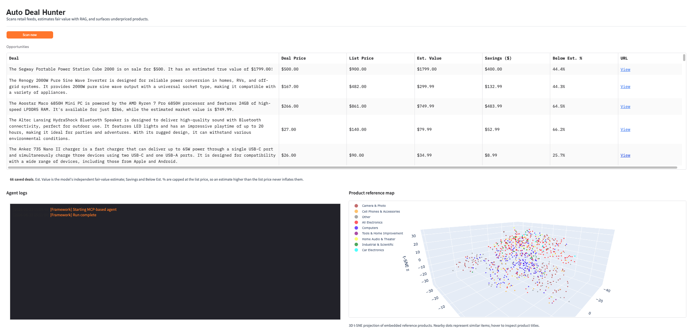

# Auto Deal Hunter

Auto Deal Hunter is an MCP-orchestrated Python app that scans retail deal feeds, estimates a product's market value via **RAG** over an independent Amazon reference set, and surfaces deals whose current price appears meaningfully below that estimate.

## Demo



The Gradio app shows saved opportunities, live agent logs, and a 3D projection of the embedded product reference library.

## Features

- **Scan** — Fetches new retail deals from DealNews RSS feeds for Electronics, Computers, and Smart Home.
- **Estimate** — Retrieves similar Amazon catalog items from ChromaDB and asks an LLM (default `gpt-4o-mini`, set via `LLM_MODEL`) for a fair-value estimate.
- **Cost-aware** — Logs LLM token usage and an estimated dollar cost per run.
- **Guardrail** — Caps reported savings at the seller's list price when a list price is available, reducing false bargains from high model estimates.
- **Notify** — Sends optional Pushover notifications for compelling deals.
- **Gradio UI** — Displays the opportunity table, guardrail summary, logs, and a 3D t-SNE map of the vector store.

## Prerequisites

- Python 3.10+
- OpenAI API key for the agent loop and price estimator
- [Hugging Face](https://huggingface.co/) account and token to download the McAuley-Lab dataset
- Optional: Pushover user/app tokens for push notifications

## Installation

```bash
python -m venv .venv
source .venv/bin/activate  # On Windows: .venv\Scripts\activate
pip install -r requirements.txt
```

## Configuration

Copy `.env.example` to `.env` and fill in your values:

```bash
cp .env.example .env   # Windows: copy .env.example .env
```

Required: `OPENAI_API_KEY`, `HF_TOKEN`. Optional: `PUSHOVER_USER`/`PUSHOVER_TOKEN` for push notifications. See [Environment Variables](#environment-variables) for the full list.

## Quick Start

### 1. Build the vector store

Build this once before running the agent. The script downloads the Electronics category of
[McAuley-Lab/Amazon-Reviews-2023](https://huggingface.co/datasets/McAuley-Lab/Amazon-Reviews-2023)
for RAG-based price estimation. This reference set is independent of DealNews, so the estimator
is not anchored to the deal's own discount or list price.

For a faster first run, build a smaller local store:

```bash
MCAULEY_MAX_ITEMS=1000 EVAL_HOLDOUT_SIZE=50 python scripts/build_vector_store.py
```

For the default larger store:

```bash
python scripts/build_vector_store.py
```

By default, the vector store is written to `data/products_vectorstore/`. Set
`PRODUCTS_VECTORSTORE_PATH` to use a different location. A holdout sample is saved to
`data/eval_holdout.json` and is excluded from the vector store, so `scripts/eval_pricers.py`
can measure generalization without retrieving the exact test item.

### 2. Run the agent

```bash
python app/deal_hunter.py
```

This opens a Gradio UI in your browser. The agent scans deals, estimates values, saves opportunities, and can send notifications. It also auto-refreshes every 5 minutes.
Runtime opportunities are stored in `data/deals.sqlite` by default. If an older
`data/memory.json` file exists, it is imported into SQLite on startup.

## Docker

Docker is the easiest way to run the app with a clean Python environment.

1. Create `.env` from the example and fill in your keys:

```bash
cp .env.example .env
```

2. Build the vector store once. The compose service mounts `./data` into the container, so the generated vector store and SQLite runtime data persist across container rebuilds:

```bash
docker compose run --rm auto-deal-hunter python scripts/build_vector_store.py
```

For a faster first run:

```bash
docker compose run --rm -e MCAULEY_MAX_ITEMS=1000 -e EVAL_HOLDOUT_SIZE=50 auto-deal-hunter python scripts/build_vector_store.py
```

3. Start the Gradio app:

```bash
docker compose up --build
```

Open `http://localhost:7860` after the container starts.

For dependency snapshots, use a fresh virtual environment or a Docker build from a fixed commit.
Avoid generating lockfiles from a broad Anaconda/base environment because unrelated packages and
local file URLs can leak into the snapshot.

## How It Works

```text
                 ┌──────────────────── MCP server (stdio) ────────────────────┐
                 │  scan_deals        estimate_value         notify_deal      │
                 └────────┬───────────────┬─────────────────────┬─────────────┘
                          │               │                     │
   DealNews RSS ──▶ ScannerAgent    FrontierAgent          MessagingAgent ──▶ Pushover
                    (filter + LLM   (RAG: ChromaDB +        (LLM-crafted
                     selection)      LLM estimate)           message)
                          │               │                     ▲
                          ▼               ▼                     │
   MCP agent loop ──▶ candidates ──▶ estimates ──▶ deterministic best deal (max capped discount)
                                                          │
                                                          ▼
                                              SQLite store + Gradio UI
```

1. `ScannerAgent` fetches DealNews RSS entries and extracts product details, deal price, and list price when available.
2. Used, refurbished, renewed, open-box, and pre-owned items are filtered out before selection.
3. `FrontierAgent` embeds deal descriptions and retrieves similar Amazon products from ChromaDB.
4. An LLM (default `gpt-4o-mini`) estimates market value from the retrieved product context and returns a structured price.
5. MCP tools coordinate the scan, estimate, and notify actions. The agent *gathers* candidates and their estimates, but the single best deal is chosen **deterministically** by a `max` over the list-price-capped discount ([`app/deal_scoring.py`](app/deal_scoring.py)) rather than left to model judgment — reproducible and provably optimal over the candidates seen.
6. Gradio displays opportunities, live logs, guardrail summary, and a 3D t-SNE view of the vector store.

Each run also logs LLM token usage and an estimated dollar cost ([`app/usage.py`](app/usage.py)), and scraped DealNews pages are cached on disk ([`app/http_cache.py`](app/http_cache.py)) so repeated scans are fast and gentle on the source.

### Design notes: why MCP + a deterministic selector

The deal-hunting flow itself is deterministic (scan → estimate → pick the biggest bargain), so
the LLM is **not** trusted to choose the winner. The MCP agent loop is used to *orchestrate and
gather* — calling tools to scan and to estimate each candidate — while final selection is a plain
`max` over the list-price-capped discount. This keeps the parts LLMs are good at (summarizing
listings, estimating value from context) and removes the part they are unreliable at (consistently
picking the optimal option), so the surfaced deal is reproducible rather than a sampling artifact.
Exposing the tools over MCP keeps the scan/estimate/notify capabilities reusable by any MCP client,
not just this loop.

## Estimate quality guardrail

The opportunity table reports savings as `min(estimate, list_price) - deal_price` when a list
price is available, and as `estimate - deal_price` when no list price is known. This keeps a high
model estimate from manufacturing savings above the seller's own list price.

- **The estimate stays independent.** The pricer never sees the seller's list/MSRP price, so
  the estimate can't simply echo it.
- **`list_price` is a downstream sanity bound.** A new-retail item's fair value should not
  exceed its original price. The dashboard shows the share of checkable deals whose estimate
  exceeds list price. Deals with no detected list price are left unchecked rather than penalized.

## Evaluation

Two scripts score the system on the held-out McAuley sample in `data/eval_holdout.json` (items
excluded from the vector store, so they measure generalization rather than exact-match lookup).

> **The numbers below are an illustrative snapshot** from a small local run (3,000-item store,
> `gpt-4o-mini`). They are dated and depend on the model, the vector store size, and `--size`;
> run the scripts yourself for current figures rather than treating these as fixed.

### Pricer (end-to-end)

```bash
python scripts/eval_pricers.py --size 200
```

Runs `FrontierAgent` (RAG + LLM) against the holdout, scoring each estimate against the item's
known price. To save aggregate metrics and fail the command when quality drifts beyond limits
(useful in CI):

```bash
python scripts/eval_pricers.py --size 200 --output-json data/eval_metrics.json --max-mae 150 --max-abs-bias 50 --max-over-rate 0.65
```

Example output (`--size 20`, illustrative):

```text
MAE: $18.03   RMSE: $31.87   Bias: +$9.96   Over-prediction: 65%   n=20
LLM usage: 20 calls, 19,921 in + 240 out tokens, ~$0.0031
```

| Metric | Meaning | How to read it |
|--------|---------|----------------|
| **MAE** | Mean absolute error, in dollars | Average miss regardless of direction — lower is better |
| **RMSE** | Root mean squared error, in dollars | Like MAE but penalizes large misses more — lower is better |
| **Bias** | Mean *signed* error (estimate − truth) | Direction of the error: `+` means the pricer runs high on average, `−` means low; near `$0` is well-centered |
| **Over-prediction** | Share of items estimated above the true price | How often it guesses high; well above 50% signals a systematic upward tilt |

**Bias** and **over-prediction** are the two to watch: they quantify the upward tilt that makes
estimates exceed a deal's list price (the example above, `+$9.96` / `65%`, shows exactly that
tilt — the guardrail exists to absorb it). The run also prints estimated LLM token cost.

### Retriever (no LLM)

End-to-end price error blends two failure modes: a bad retriever (wrong neighbors) and a bad LLM
(wrong reasoning over good neighbors). To isolate the retriever — no LLM calls, near-free — run:

```bash
python scripts/eval_retrieval.py --size 200 --k 5
```

Example output (`--size 50 --k 5`, illustrative):

```text
category_precision@5: 46%   hit_rate@5: 80%   price_MAPE@5: 133%   n=50
```

It scores `category_precision@k` (are the neighbors the right category?), `hit_rate@k` (at least
one same-category neighbor?), and `price_MAPE@k` (how close the median neighbor price is to the
true price). Use this to tell whether a high pricer MAE is a retrieval problem or a reasoning
problem before tuning either side.

### Reproducibility

All LLM calls run at `temperature=0` (`LLM_TEMPERATURE`) with a fixed `seed` (`LLM_SEED`). Note
that OpenAI's `seed` is **best-effort**, not a hard guarantee — outputs can still vary slightly
between runs and across model updates. Treat the eval as low-variance, not bit-exact.

## Development

Run the test suite (unit tests for the scrapers, agents, MCP hand-off, deterministic selector,
cost tracker, and eval metrics):

```bash
python -m unittest discover -s tests
```

Lint with `ruff check .`. Tests run offline — network, OpenAI, and Sentence-Transformers calls
are stubbed — so no API key or vector store is required.

## Project Structure

```text
auto-deal-hunter/
├── app/                   # Runtime app code
│   ├── deal_hunter.py     # Gradio UI
│   ├── deal_agent_framework.py
│   ├── agent_mcp.py
│   ├── mcp_server.py
│   ├── config.py          # Single source of truth for model/embedding settings
│   ├── deal_scoring.py    # Deterministic best-deal selection
│   ├── usage.py           # LLM token + cost accounting
│   ├── http_cache.py      # On-disk read-through cache for scraped pages
│   ├── log_utils.py
│   └── paths.py           # Shared runtime/data paths
├── agents/                # Agent implementations
│   ├── agent.py
│   ├── scanner_agent.py
│   ├── frontier_agent.py
│   └── messaging_agent.py
├── models/                # Domain models and RSS/item data helpers
│   ├── deals.py
│   └── items.py
├── scripts/               # Offline data prep and evaluation
│   ├── build_vector_store.py
│   ├── eval_pricers.py    # End-to-end price accuracy (RAG + LLM)
│   └── eval_retrieval.py  # Retriever-only quality (no LLM)
├── data/                  # Runtime state and local vector store
├── pyproject.toml
└── requirements.txt
```

## Environment Variables

| Variable | Description |
|----------|-------------|
| **Credentials** | |
| `OPENAI_API_KEY` | OpenAI API key for the MCP agent loop and RAG estimator |
| `HF_TOKEN` | Hugging Face API token (for downloading McAuley-Lab dataset) |
| `PUSHOVER_USER` | Pushover user key (for push notifications) |
| `PUSHOVER_TOKEN` | Pushover app token |
| **Model & runtime config** | |
| `LLM_MODEL` | Chat model for every agent (default: `gpt-4o-mini`) |
| `LLM_TEMPERATURE` | Sampling temperature for all LLM calls (default: `0`) |
| `LLM_SEED` | Best-effort sampling seed for reproducibility (default: `42`) |
| `EMBEDDING_MODEL` | Sentence-Transformers model for the vector store; must match between build and query (default: `sentence-transformers/all-MiniLM-L6-v2`) |
| `DEALHUNTER_HTTP_CACHE` | Set to `0`/`off`/`false` to disable the scraped-page cache (default: on) |
| **Paths & data** | |
| `PRODUCTS_VECTORSTORE_PATH` | Path to ChromaDB store (default: `data/products_vectorstore`) |
| `DEALS_DB_PATH` | SQLite runtime database path (default: `data/deals.sqlite`) |
| `MEMORY_FILENAME` | Legacy JSON memory path imported on startup when present (default: `data/memory.json`) |
| `MCAULEY_CATEGORY` | McAuley-Lab category to pull (default: `Electronics`) |
| `MCAULEY_MAX_ITEMS` | Cap on items embedded into the vector store (default: `50000`) |
| `EVAL_HOLDOUT_SIZE` | Items held out for `eval_pricers.py` (default: `500`) |
| `EVAL_HOLDOUT_PATH` | Holdout sample path used by `eval_pricers.py` (default: `data/eval_holdout.json`) |

## Limitations

- The reference product library is built from the 2023 McAuley-Lab Amazon dataset, so estimates can lag current market conditions.
- Fast-moving categories such as laptops, phones, GPUs, storage, and smart-home devices may be affected by refresh cycles, seasonal pricing, clearance sales, and discontinued inventory.
- Deal quality depends on RSS feed availability and DealNews page structure.
- Price estimates are model-assisted approximations, not purchasing or financial advice.
- The first vector-store build can take time and disk space, especially with the default 50,000 item cap.
- Notifications are optional; without Pushover credentials, notification text is logged instead.

## Future Improvements

- Add optional live-price retrieval from retailer APIs, affiliate feeds, or shopping/search APIs to refresh RAG context with current market data.
- Cache live lookup results with timestamps to balance freshness, latency, API cost, and rate limits.
- Track estimate accuracy over time by comparing surfaced deals against later observed prices or manually verified benchmarks.

## License

MIT License. See [LICENSE](LICENSE) for details.
