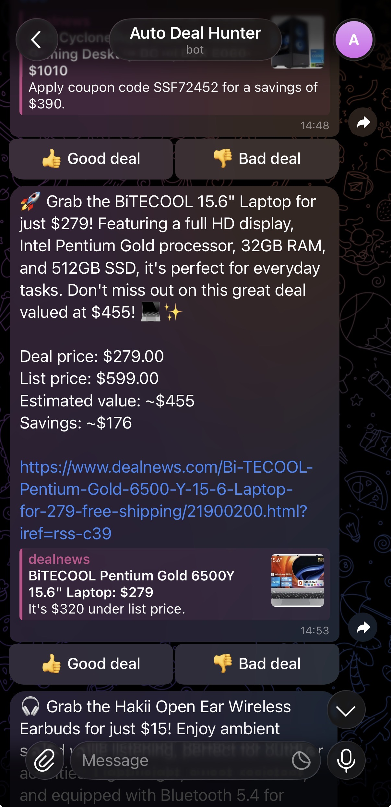

# Auto Deal Hunter

Auto Deal Hunter watches retail deal feeds, estimates whether each product is actually underpriced, and surfaces the best opportunities in a local dashboard with optional phone notifications. It is a local screening tool for reviewing deals, not an auto-buying bot.

Under the hood, it uses **RAG** over an independent Amazon reference set for fair-value estimates, applies deterministic scoring and list-price guardrails to reduce false bargains, and exposes scan/estimate/notify capabilities as MCP tools for reuse by MCP clients.

## Demo

The dashboard shows saved opportunities, live scan logs, guardrail stats, and a 3D projection of the embedded product reference library. Optional Telegram notifications, with Pushover as a fallback, send the selected deal to your phone.

Gradio dashboard:


Telegram notification:



## Features

- **Scan** — Fetches new retail deals from DealNews RSS feeds for Electronics, Computers, and Smart Home.
- **Estimate** — Retrieves similar Amazon catalog items from ChromaDB and asks an LLM (default `gpt-4o-mini`, set via `LLM_MODEL`) for a fair-value estimate, shrunk toward the comparables' median price when the retrieval match is weak.
- **Optional re-rank** — Can re-rank a wider retrieval set (`RERANK_MODE=cross-encoder` or `llm`) before pricing.
- **Cost-aware** — Logs LLM token usage and an estimated dollar cost per run.
- **Guardrail** — Caps reported savings at the seller's list price when a list price is available, reducing false bargains from high model estimates.
- **Identity-aware** — Normalizes multi-packs to per-unit pricing and skips bundles/subscriptions that do not compare cleanly.
- **Notify** — Sends optional Telegram notifications, or Pushover as a fallback, only for compelling deals with sufficient RAG confidence.
- **Gradio UI** — Displays the opportunity table, guardrail summary, logs, and a 3D t-SNE map of the vector store. Each deal row carries in-row 👍/👎 feedback cells (the saved label appears as ✅) and a 🔔 cell to push that deal to your phone.

## Requirements

- Python 3.10+
- OpenAI API key for the agent loop and price estimator (or an OpenAI-compatible endpoint — see
  [`OPENAI_BASE_URL`](#common-environment-variables))
- [Hugging Face](https://huggingface.co/) access for downloading the McAuley-Lab dataset. `HF_TOKEN` is optional unless dataset access or rate limits require authentication.
- Network and local disk for the first vector-store build. Even the small validation build downloads dataset shards and the embedding model.
- Optional: Telegram or Pushover credentials for push notifications.

## Quick Start

### 1. Install

```bash
python -m venv .venv
source .venv/bin/activate  # On Windows: .venv\Scripts\activate
pip install -e .
```

### 2. Configure

Copy `.env.example` to `.env` and fill in your values:

```bash
cp .env.example .env   # Windows: copy .env.example .env
```

Required: `OPENAI_API_KEY`. Set `HF_TOKEN` if Hugging Face requires authentication for the dataset download. Optional: `TELEGRAM_BOT_TOKEN`/`TELEGRAM_CHAT_ID` for push notifications. See [Configuration](#configuration) for the common settings.

### 3. Build the vector store

Build this once before running the agent. The script downloads the Electronics category of
[McAuley-Lab/Amazon-Reviews-2023](https://huggingface.co/datasets/McAuley-Lab/Amazon-Reviews-2023)
for RAG-based price estimation.

For a faster first run, use the smaller local store below. It still downloads the dataset, but
keeps the initial build short enough to validate the app before spending time and disk on the
default 50,000-item store:

```bash
MCAULEY_MAX_ITEMS=1000 EVAL_HOLDOUT_SIZE=50 python -m auto_deal_hunter.scripts.build_vector_store
```

For the default larger store, expect a longer network-bound build and more local disk usage:

```bash
python -m auto_deal_hunter.scripts.build_vector_store
```

By default, the vector store is written to `data/products_vectorstore/`. Set
`PRODUCTS_VECTORSTORE_PATH` to use a different location. A holdout sample is saved to
`data/eval_holdout.json` and is excluded from the vector store, so `scripts/eval_pricers.py`
can measure generalization without retrieving the exact test item.

### 4. Run the app

```bash
python -m auto_deal_hunter.app.ui
```

This opens a Gradio UI in your browser. The app scans deals, estimates values, saves
opportunities to `data/deals.sqlite`, and auto-refreshes every 5 minutes. Saved opportunities
not re-confirmed within `DEALS_TTL_HOURS` (default 72h) are pruned so the table stays focused
on currently-live deals.

If the browser does not open automatically, visit `http://127.0.0.1:7860`.

Common first-run fixes:

- Missing vector store: run `python -m auto_deal_hunter.scripts.build_vector_store`.
- Hugging Face download fails: set `HF_TOKEN` in `.env`.
- OpenAI request fails: confirm `OPENAI_API_KEY` in `.env`.
- Port `7860` is busy: run `GRADIO_SERVER_PORT=7861 python -m auto_deal_hunter.app.ui`.

## Docker

Docker is the easiest way to run the app with a clean Python environment.

1. Create `.env` from the example and fill in your keys:

```bash
cp .env.example .env
```

2. Build the vector store once. The compose service mounts `./data` into the container, so the generated vector store and SQLite runtime data persist across container rebuilds.

For a faster first run, build a small validation store:

```bash
docker compose run --rm -e MCAULEY_MAX_ITEMS=1000 -e EVAL_HOLDOUT_SIZE=50 auto-deal-hunter python -m auto_deal_hunter.scripts.build_vector_store
```

For the default larger store:

```bash
docker compose run --rm auto-deal-hunter python -m auto_deal_hunter.scripts.build_vector_store
```

3. Start the Gradio app:

```bash
docker compose up --build
```

Open `http://localhost:7860` after the container starts.

To follow startup logs:

```bash
docker compose logs -f auto-deal-hunter
```

## Configuration

Only `OPENAI_API_KEY` is required for normal runs. `HF_TOKEN` is needed only when Hugging Face
dataset access or rate limits require authentication; notification variables are optional.
See [`.env.example`](.env.example) for advanced tuning, runtime paths, cache controls, and
evaluation settings.

### Common environment variables

| Variable | Description | Default |
|----------|-------------|---------|
| **Credentials** | | |
| `OPENAI_API_KEY` | API key for the MCP agent loop and RAG estimator (OpenAI, or the configured OpenAI-compatible endpoint) | — |
| `OPENAI_BASE_URL` | Point the OpenAI client at an OpenAI-compatible Chat Completions endpoint. The endpoint must support the features this app uses, especially tool calling; structured-output and `seed` behavior vary by backend | — |
| `HF_TOKEN` | Hugging Face API token, used when dataset access or rate limits require authentication | — |
| `TELEGRAM_BOT_TOKEN` | Telegram bot token for push notifications. Create one with BotFather | — |
| `TELEGRAM_CHAT_ID` | Telegram chat id that receives deal notifications | — |
| `TELEGRAM_FEEDBACK_ENABLED` | Receive Telegram Good/Bad button clicks and save them to the opportunity database | `false` |
| `TELEGRAM_POLL_TIMEOUT_SECONDS` | Telegram long-poll timeout used by the feedback listener | `25` |
| `PUSHOVER_USER` | Pushover user key, used when Telegram is not configured | — |
| `PUSHOVER_TOKEN` | Pushover app token, used when Telegram is not configured | — |
| **Common settings** | | |
| `LLM_MODEL` | Default chat model, served by the configured OpenAI-compatible endpoint | `gpt-4o-mini` |
| `SCANNER_MODEL` | Optional scanner override for feed selection/summarization | inherits `LLM_MODEL` |
| `PRICER_MODEL` | Optional pricer override for RAG-based fair-value estimation | inherits `LLM_MODEL` |
| `MESSAGING_MODEL` | Optional notification-copy model override | inherits `LLM_MODEL` |
| `JUDGE_MODEL` | Optional LLM-as-a-judge model override | inherits `LLM_MODEL` |
| `MCP_MODEL` | Optional model for the MCP tool-calling demonstration loop | inherits `LLM_MODEL` |
| `OPENAI_API_STYLE` | OpenAI API surface for scanner/pricer/messaging/judge calls: `responses` or `chat` fallback for compatible endpoints | `responses` |
| `PRODUCTS_VECTORSTORE_PATH` | Path to ChromaDB store | `data/products_vectorstore` |
| `RERANK_MODE` | Optional second-stage retrieval re-ranker: `off`, `cross-encoder`, or `llm` | `off` |
| `RERANK_CANDIDATES` | Number of vector-search candidates to fetch before re-ranking | `20` |
| `DEALS_TTL_HOURS` | Prune opportunities not re-confirmed within this many hours; `0` disables expiry | `72` |
| `MCAULEY_MAX_ITEMS` | Cap on items embedded into the vector store | `50000` |
| `EVAL_HOLDOUT_SIZE` | Items held out for `eval_pricers.py` | `500` |

### Notifications

Telegram setup:

1. Message `@BotFather` in Telegram, create a bot, and copy its token into `TELEGRAM_BOT_TOKEN`.
2. Send any message to your new bot.
3. Open `https://api.telegram.org/bot<TELEGRAM_BOT_TOKEN>/getUpdates` and copy the `message.chat.id` value into `TELEGRAM_CHAT_ID`.

Pushover is also supported as an optional fallback: set `PUSHOVER_USER` and `PUSHOVER_TOKEN`.
Telegram is preferred when both are configured.

Set `TELEGRAM_FEEDBACK_ENABLED=true` to add `Good deal` / `Bad deal` buttons to Telegram
notifications and run the callback listener. Notifications show deal price, list price when
available, and estimated value while retaining the DealNews link preview. Button clicks write
the same `good_deal` / `bad_deal` labels used by the dashboard to `DEALS_DB_PATH`.

### Model tiering

`LLM_MODEL` remains the global default. Override individual roles only when the eval data supports
the trade-off: the scanner and message writer are good candidates for cheaper models, while the
pricer and judge should stay on the strongest affordable model because they affect numeric
valuation and quality gates.

That trade-off is measurable, not hypothetical. `scripts/compare_scanner_models.py` feeds the
same scraped batch (via the HTTP cache) to each candidate scanner model, judges every selected
deal's summary and price against the raw listing with `ScanJudge` (a fixed `JUDGE_MODEL`
referee), and prices each model's tokens from its own rate sheet:

```bash
python -m auto_deal_hunter.scripts.compare_scanner_models --models gpt-4o-mini gpt-4.1-nano --output-json docs/eval/scanner_models.json
```

One local batch (`docs/eval/scanner_models.json`): both models selected the **same five
deals**; `gpt-4.1-nano` scored 5/5 faithful at ~35% lower scan cost, while `gpt-4o-mini` had
one summary flagged for adding specs not present in the listing (injected from prior product
knowledge — exactly the failure the judge exists to catch). A single RSS batch with five
selections per model is directional, not conclusive: rerun on a few different batches before
setting `SCANNER_MODEL=gpt-4.1-nano`, but the mechanism and the measurement are in place.

The scanner, pricer, notification writer, and judge use the Responses API by default. Set
`OPENAI_API_STYLE=chat` when pointing `OPENAI_BASE_URL` at an OpenAI-compatible endpoint that
only implements Chat Completions. The optional MCP tool-calling demo loop still uses Chat
Completions because that path is kept specifically as the compatibility/demo route.

## How It Works

```text
   DealNews RSS ──▶ ScannerAgent    PricerAgent            MessagingAgent ──▶ Telegram
                    (filter + LLM   (RAG: ChromaDB +        (LLM-crafted
                     selection)      LLM estimate)           message)
                          │               │                     ▲
                          ▼               ▼                     │
   scan pipeline ──▶ candidates ──▶ estimates ──▶ deterministic best deal (max total capped savings)
                                                          │
                                                          ▼
                                              SQLite store + Gradio UI
```

1. `ScannerAgent` fetches DealNews RSS entries and extracts product details, deal price, and list price when available.
2. Used, refurbished, renewed, open-box, and pre-owned items are filtered out before selection. Bundles and subscriptions are skipped, and multi-packs are rebased to a per-unit price so they are valued against single-unit comparables.
3. `PricerAgent` embeds deal descriptions and retrieves similar Amazon products from ChromaDB. If `RERANK_MODE` is enabled, it retrieves a wider candidate set and re-ranks it before keeping the top comparables.
4. An LLM (default `gpt-4o-mini`) estimates market value from the retrieved product context and returns a structured price. The raw estimate is then shrunk toward the median price of the retrieved comparables, weighted by retrieval confidence, so a weak RAG match cannot win the scan on a wild guess (see [Estimate guardrail](#estimate-guardrail)).
5. The pipeline *gathers* candidates and their estimates, but the single best deal is chosen **deterministically**, not by model judgment ([`core/scoring.py`](core/scoring.py); see [Deterministic selection](#deterministic-selection)).
6. A push is sent for the best deal — unless its estimate rests on a weak RAG match (below `RAG_MIN_CONFIDENCE`), in which case the deal is still saved but not notified.
7. Gradio displays opportunities, live logs, guardrail summary, and a 3D t-SNE view of the vector store.

Each run also logs LLM token usage and an estimated dollar cost ([`infra/usage.py`](infra/usage.py)), and scraped DealNews pages are cached on disk ([`infra/http_cache.py`](infra/http_cache.py)) so repeated scans are fast and gentle on the source.

### Deterministic selection

The deal-hunting flow is mostly deterministic (scan → estimate → score candidates), so the LLM
is **not** trusted to choose the winner. By default the pipeline runs **in-process**
([`app/pipeline.py`](app/pipeline.py)): it calls the scanner, estimates each candidate, and
selects the best by a plain `max` over the list-price-capped total savings (per-unit discount ×
pack size, [`core/scoring.py`](core/scoring.py)) — keeping the LLM for the parts it is good at
(summarizing listings and estimating value from context).

The same three capabilities are also exposed as MCP tools ([`app/mcp_server.py`](app/mcp_server.py))
so any MCP client can reuse them, and an LLM tool-calling loop that drives those tools
([`app/mcp_client.py`](app/mcp_client.py)) is kept as a demonstration of MCP orchestration —
opt in with `SCAN_MODE=agent`. The direct pipeline is the default because the scan result is
deterministic after candidates and estimates are gathered.

Installing the project with `pip install -e .` keeps the package tree (`app`, `agents`, `domain`,
`ingest`, `core`, `infra`, `evaluation`, `scripts`) importable from both the direct pipeline and
the spawned MCP server process, so scans behave the same whether they run in-process or through
the MCP demonstration path.

### Estimate guardrail

The opportunity table reports savings as `min(estimate, list_price) - deal_price` when a list
price is available, and as `estimate - deal_price` when no list price is known. This keeps a high
model estimate from manufacturing savings above the seller's own list price.

Example: if the model estimates `$120`, the seller list price is `$80`, and the deal price is
`$50`, reported savings are `$30` (`min(120, 80) - 50`), not `$70`.

- **The estimate stays independent.** The pricer never sees the seller's list/MSRP price, so
  the estimate can't simply echo it.
- **`list_price` is a downstream sanity bound.** A new-retail item's fair value should not
  exceed its original price. The dashboard shows the share of checkable deals whose estimate
  exceeds list price. Deals with no detected list price are left unchecked rather than penalized.
- **Low-confidence estimates are shrunk toward their comparables.** Each scan keeps only the
  top-savings candidate, so the winner is systematically the estimate with the largest upward
  error (winner's curse) — a variance problem, not a bias one (holdout bias is ~0). The pricer
  therefore blends the raw LLM estimate with the median price of its retrieved comparables,
  weighted by retrieval confidence (`confidence * estimate + (1 - confidence) * median`),
  reining in exactly the estimates whose RAG basis is weakest. On the 149-item holdout this cut
  the over-prediction error on $100+ items by ~20% without moving overall bias.
- **Estimates at a multiple of list price are treated as retrieval mismatches.** Ordinary
  overestimates run a few percent above list; an estimate above `ESTIMATE_MISMATCH_RATIO`
  (default 2×) means the comparables were the wrong kind of product entirely. The deal keeps
  its capped savings and stays in the store (with `is_overestimate` monitoring intact), but
  its push confidence is zeroed and the dashboard shows `⚠️ n/a` instead of the estimate.

## Evaluation

Two scripts score the system on the held-out McAuley sample in `data/eval_holdout.json` (items
excluded from the vector store, so they measure generalization rather than exact-match lookup).

> **Figures depend on the model, the vector store size, and `--size`,** so they drift over time.
> The sample outputs below show the metric format only — run the scripts yourself for current
> numbers.

### Pricer (end-to-end)

```bash
python -m auto_deal_hunter.scripts.eval_pricers --size 200
```

Runs `PricerAgent` (RAG + LLM) against the holdout, scoring each estimate against the item's
known price. To save aggregate metrics and fail the command when quality drifts beyond limits
(useful in CI):

```bash
python -m auto_deal_hunter.scripts.eval_pricers --size 200 --output-json data/eval_metrics.json --max-mae 150 --max-abs-bias 50 --max-over-rate 0.65
```

The command prints aggregate accuracy metrics plus the run's LLM token cost:

```text
MAE: $<dollars>   RMSE: $<dollars>   Bias: +$<dollars>   Over-prediction: <pct>%   n=<count>
LLM usage: <calls> calls, <in> in + <out> out tokens, ~$<cost>
```

Watch **Bias** and **Over-prediction** first. They show whether the pricer has an upward tilt,
which is the failure mode most likely to create false bargains. **MAE** and **RMSE** measure
overall error size.

Example local baseline, using the current `data/eval_holdout.json` and vector store:

```text
python -m auto_deal_hunter.scripts.eval_pricers --size 200 --output-json docs/eval/baseline_pricer.json
MAE: $25.76   RMSE: $66.45   Bias: -$5.71   Over-prediction: 39%   n=200
LLM usage: 200 calls, 261,470 in + 2,402 out tokens, ~$0.0407
```

### Retriever (no LLM)

End-to-end price error blends two failure modes: a bad retriever (wrong neighbors) and a bad LLM
(wrong reasoning over good neighbors). To isolate the retriever — no LLM calls, near-free — run:

```bash
python -m auto_deal_hunter.scripts.eval_retrieval --size 200 --k 5
```

The command prints per-k retrieval metrics:

```text
category_precision@5: <pct>%   hit_rate@5: <pct>%   price_medianAPE@5: <pct>%   (meanAPE: <pct>%)   n=<count>
```

It scores whether neighbors are in the right category, whether at least one same-category neighbor
is found, and how close neighbor prices are to the held-out item. Use this to tell whether a high
pricer MAE is a retrieval problem or a reasoning problem before tuning either side.

Example local run, using the current `data/eval_holdout.json` and vector store:

```text
python -m auto_deal_hunter.scripts.eval_retrieval --size 200 --k 5
category_precision@5: 57%   hit_rate@5: 86%   price_medianAPE@5: 29%   (meanAPE: 48%)   n=200
```

The high hit rate means most held-out items retrieve at least one same-category neighbor, while
the lower category precision and high mean absolute percentage error show why the app treats this
as a screening/ranking signal rather than a pricing oracle. Items whose true per-unit price is
below $1 are excluded from the APE metrics (`n_ape` in the JSON output): with a near-zero
denominator, a few dollars of neighbor movement swings a single query's APE by thousands of
percentage points, which once flipped the sign of an A/B comparison on its own.

To measure the optional re-ranker:

```bash
python -m auto_deal_hunter.scripts.eval_retrieval --size 200 --k 5 --rerank cross-encoder --output-json docs/eval/rerank_cross_encoder_retrieval.json
```

On the same local holdout, `cross-encoder` moved category precision from 56.8% to 57.5%, hit
rate from 85.5% to 88.0%, and median APE from 28.6% to 28.4%, with mean APE flat (48.3% vs
48.4%). All of these differences are within sampling noise at n=200 (the standard error on a
~57% proportion is about ±3.5 points), so the honest reading is "no measurable gain," and the
re-ranker stays opt-in rather than becoming the default: it adds a cross-encoder inference pass
per deal without a demonstrated retrieval improvement.

The same conclusion holds one level up and one level down. The `llm` re-ranker scored
category precision 56.3%, hit rate 86.5%, and median APE 25.2% (`docs/eval/rerank_llm_retrieval.json`)
— again within noise of the baseline, while adding an LLM call per retrieval, so it is the most
expensive way to not improve the metrics. End-to-end (`RERANK_MODE=cross-encoder
python -m auto_deal_hunter.scripts.eval_pricers --size 200`), the pricer scored MAE $23.91 / RMSE $56.77 /
bias −$12.51 versus the baseline's MAE $25.76 / RMSE $66.45 / bias −$5.71 — MAE within noise,
with a slightly stronger low tilt. One holdout item also became unpriceable under re-ranking
(the reshuffled comparables made the model echo the prompt placeholder), which the eval now
reports as `n_failed` instead of crashing — worth watching, since a config change that shifts
retrieval can push individual items over the pricer's fail-loudly edge.

Per-query error analysis of an earlier run also showed a real failure mode worth knowing about:
`ms-marco` cross-encoders score topical relevance, not price comparability, so they can promote
a lexically better match from the wrong price tier — e.g. ranking a $39.99 square hood first for
a $9.99 lens-hood query because both say "77mm", or promoting an $89.99 triple-pack fan for a
$14 single-fan query on a brand match. Across the holdout these promotions roughly balance out
(68 queries got worse by >1pt, 70 got better), but they are the thing to fix — likely with a
price-aware re-ranking objective — before the re-ranker can earn the default slot.

### Feedback

Each dashboard row has in-row 👍/👎 cells that write manual labels to `data/deals.sqlite`;
when Telegram feedback is enabled, its Good/Bad buttons write the same labels
(the saved label is shown as ✅ in the row, and a 🔔 cell pushes that specific deal).
Label 👍 only after verifying the price is genuinely below the item's street price; label 👎
when the bargain is false (normal price elsewhere, junk listing, or a bad estimate) — the
labels are the precision ground truth, so consistency matters more than volume.
Labels are measurement-only: they never feed back into scanning, pricing, or notification
automatically. Their job is to ground manual calibration decisions (e.g. where to set
`RAG_MIN_CONFIDENCE`) via the report below.
Summarize labeled precision, including buckets by retrieval confidence, list-price coverage,
overestimate status, and discount size, with:

```bash
python -m auto_deal_hunter.scripts.feedback_report
```

### Message Judge

Notification text is free-form, so it is evaluated with an LLM-as-a-judge rather than a numeric
ground truth metric. The judge checks whether generated notifications stay faithful to the saved
deal's price, estimate, capped savings, and product facts:

```bash
python -m auto_deal_hunter.scripts.eval_messages --size 20 --output-json docs/eval/message_judge.json
```

This command uses OpenAI for both message generation and judging, so keep `--size` small when
running it interactively.

A judge that has only ever passed clean messages is itself unvalidated — 100% faithful could
mean good messages or a judge that never flags anything. `--negative-control` closes that gap:
it also judges deterministically corrupted variants of each message (first dollar amount halved
or doubled, an invented warranty/gift-card fact appended) and reports the judge's recall on
them, while the clean pass rate bounds its false-positive rate:

```bash
python -m auto_deal_hunter.scripts.eval_messages --size 20 --negative-control --output-json docs/eval/message_judge.json
```

Example local run over 8 saved opportunities:

```text
faithfulness_rate=100% mean_score=5.00 n=8
negative control: judge_recall=100% on 24 corrupted messages
LLM usage: 40 calls, 12,954 in + 2,086 out tokens, ~$0.0032
```

All 24 corrupted messages were caught (scores dropped to 1–2 with the specific misstatement
named in `issues`), and all 8 clean messages passed — so the 100% faithfulness rate on real
messages reflects a judge that demonstrably catches violations, not one that rubber-stamps.

### Reproducibility

All LLM calls run at `temperature=0` (`LLM_TEMPERATURE`), which is the strongest
reproducibility lever available. A fixed `seed` (`LLM_SEED`) is additionally sent on the Chat
Completions path (`OPENAI_API_STYLE=chat` and the MCP demonstration loop); the Responses API —
the default path — does not accept a `seed` parameter, and OpenAI's `seed` is **best-effort**
even where supported. Treat the eval as low-variance, not bit-exact.

## Development

Install development tools, then run the fastest local checks:

```bash
pip install -e ".[dev]"
python -m pytest
ruff check .
```

Tests run offline — network, OpenAI, and Sentence-Transformers calls are stubbed — so no API key
or vector store is required.

### Reproducible installs

`pyproject.toml` pins only version *ranges* (with upper bounds capping the next major of the
fast-moving libraries), which is right for development. For a byte-for-byte reproducible deploy,
generate a lockfile **in the target environment** (matching OS and Python version — a macOS lock
won't match a Linux container):

```bash
python -m venv .venv && source .venv/bin/activate
pip install -e .
pip freeze --exclude-editable > requirements.lock
```

Commit `requirements.lock` and install from it in the container (`pip install -r requirements.lock`).
Regenerate it whenever `pyproject.toml` dependencies change. Do **not** run `pip freeze` from a broad
Anaconda/base environment — unrelated packages and local file URLs leak into the snapshot.

## Project Structure

```text
auto-deal-hunter/
├── app/                   # Application entrypoint + orchestration
│   ├── ui.py              # Gradio UI (entrypoint)
│   ├── orchestrator.py    # Outer run loop: trigger scan, persist, prune, report
│   ├── pipeline.py        # Default in-process scan → estimate → select → notify
│   ├── mcp_client.py      # Agentic loop driving the MCP tools (SCAN_MODE=agent)
│   └── mcp_server.py      # MCP server exposing scan/estimate/notify tools
├── agents/                # Agent implementations
│   ├── agent.py
│   ├── scanner_agent.py
│   ├── pricer_agent.py    # RAG + LLM fair-value estimator
│   └── messaging_agent.py
├── domain/                # Pure domain models (no I/O)
│   ├── deal.py            # Deal, DealSelection, Opportunity
│   ├── identity.py        # Product identity kinds and metadata
│   └── item.py            # McAuley catalog item
├── ingest/                # DealNews scraping + price extraction
│   ├── identity.py        # Deterministic product-identity extraction
│   ├── scraper.py         # ScrapedDeal, RSS fetch, new-retail filtering
│   └── list_price.py      # List/deal-price regex + widget parsing
├── core/                  # Business logic
│   ├── identity_policy.py # Priceability and per-unit rebasing rules
│   ├── reranker.py        # Optional cross-encoder / LLM second-stage retrieval re-rankers
│   ├── scoring.py         # Deterministic best-deal selection
│   ├── source_ids.py      # Stable per-deal id (deal_id) + source registry
│   └── opportunity_store.py  # SQLite persistence
├── infra/                 # Cross-cutting infrastructure
│   ├── config.py          # Single source of truth for model/embedding settings
│   ├── usage.py           # LLM token + cost accounting
│   ├── http_cache.py      # On-disk read-through cache for scraped pages
│   ├── log_utils.py
│   └── paths.py           # Shared runtime/data paths
├── evaluation/            # Importable, tested eval metrics
│   ├── judge.py           # LLM-as-a-judge for notification faithfulness
│   ├── pricer.py          # MAE / bias / over-prediction
│   └── retrieval.py       # category_precision@k / hit_rate@k / price_medianAPE@k
├── scripts/               # Thin CLI wrappers
│   ├── audit_identity.py   # Identity-rule audit over live scraped deals
│   ├── build_vector_store.py
│   ├── compare_embeddings.py # Build/evaluate multiple embedding stores
│   ├── eval_messages.py   # LLM-as-a-judge notification eval
│   ├── eval_pricers.py    # End-to-end price accuracy (RAG + LLM)
│   ├── eval_retrieval.py  # Retriever-only quality (no LLM)
│   └── feedback_report.py # Manual good/bad feedback summary
├── data/                  # Runtime state and local vector store
└── pyproject.toml
```

## Limitations

- **Reference-based estimates, not live quotes.** `Est. Value` is computed from a static local
  vector store plus an LLM. It is useful for ranking deals, but it can lag current market prices,
  especially for fast-moving categories, discontinued products, new releases, and long-tail brands
  with weak comparables.
- **Reference-set category coverage bounds estimate quality.** The vector store is built from one
  McAuley category (Electronics by default), while deal feeds also serve products that category
  barely covers (e.g. plain alkaline batteries retrieve battery *chargers* as nearest neighbors).
  Retrieval confidence measures embedding proximity, not category identity, so it cannot detect
  this by itself. When the estimate lands above `ESTIMATE_MISMATCH_RATIO` × list price, the deal
  is treated as a retrieval mismatch: its push is withheld and the dashboard shows `⚠️ n/a`
  instead of the estimate (savings stay list-price-capped and real). **Residual exposure:** a
  mismatched estimate on a deal with *no* detected list price cannot be caught by this guard —
  there is nothing to cap against or compare with — and competes in ranking at face value.
- **Source-dependent scans.** Deal quality depends on RSS feed availability and DealNews page
  structure.
- **Runtime dependencies can fail.** Scans depend on DealNews pages, the local vector store, and an
  OpenAI-compatible endpoint. Network errors, model/API failures, or missing vector-store data can
  interrupt a run.
- **Screening signal only.** Treat estimates as a shortlist signal, not as the sole reason to buy.
- **Local build cost.** The first vector-store build can take time and disk space, especially with
  the default 50,000-item cap.

## Roadmap

- **Estimate confidence metadata.** Track comparable count, similarity distance, price spread,
  vector-store build timestamp, and identity/quantity/variant match strength. Low-confidence deals
  could be displayed but skipped for push notifications.
- **Optional live-price layer.** Add exact live-match pricing when high-confidence same-spec
  listings are available, and optionally refresh RAG comparables with current prices. Compute a
  median or weighted median from valid new, in-stock listings while excluding DealNews and
  same-source mirrors.
- **Accuracy tracking over time.** Manual good/bad labels are recorded locally and bucketed by
  confidence/guardrail signals; a later live-price layer could add observed resale/current prices
  and trend the precision report over time.

## License

MIT License. See [LICENSE](LICENSE) for details.
